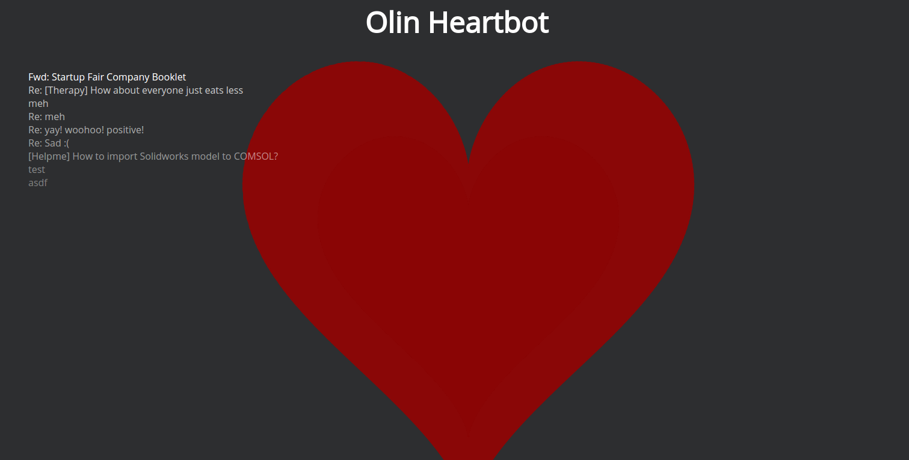

# heartbot
A visualization of Olin's email heartbeat

## Vision

The "heart" of Olin is its email traffic, constantly pinging people with meeting requests, work updates, information, free food notifications, rants, and more.  However, this undercurrent of Olin life is invisible unless you are personally plugged into everything...until now.

Heartbot is an app that watches the email traffic on every one of Olin's mailing lists.  Even when no one responds to your helpme about lost shoes, Heartbot is there for you, always listening.

Heartbot's web presence is represented by a heart visualization that "beats" every time it recieves an email, displaying the subject line in a ticker-style list to the side.  Additionally, every beat is accompanied by a piano note whose pitch is determined by the sentiment of the email subject line.  A lot of frustrated or angry emails will result in a low, methodical beat, while high traffic of happy and enthused emails will be a high-pitched and joyful tune.  

Additionally, the heart changes size to represent total size of email traffic in the past hour.  In the middle of the day, the heart will take up the whole screen, a larger-than-life presence onscreen the way that the emails are in real life.  At midnight, the heart will be small and silent, beating only for the occaisional late-night pizza email.

Heartbot presents a simple, clean interface for seeing one representation of Olin emails.  It has no statistics or data tracking (yet), and is simply a real-time metric of what invisible packets of thought are flying across the network cables at that time.  Additionally, it turns the mundane frustration of heavy email traffic into a musical experience.  The dread of finding a full inbox is offset, at least slightly, by knowing that many emails leads to better music from Heartbot.

## Heartbot in Action



## To Run

Make sure you have redis installed and available on `localhost:6379` (the default).

First time:
  - `virtualenv venv --python=python3`
  - `pip install -r requirements.txt`

After that, whenever you open a new terminal:
  - `source venv/bin/activate` (you should see `(venv)` prepended before your command prompt)

Then, `python collector.py` and `python server.py`.

The collector will not run without set environment variables for the email and password of the associated account called HEARTBOT_USERNAME and HEARTBOT_PASSWORD.  Be sure to set these before running.  Contact us if you want the credentials of the original account used for the project.

## How it Works


`collector.py`: The collector simply queries a set email account using Python's POP library, then pushes a JSON string:
```
{
	"subject": "subject line of message",
	"date": "date from the message's `Date` header",
	"size": int size of message in bytes,
	"sentiment":"sentiment of the message on a scale -1 to 1"
}
```
to Redis for each message it finds.  This script runs constantly in the background, sending a new query every five seconds.

`server.py`: The Flask API has one endpoint that, when queried, attempts to retreive and return one of those JSON blobs from Redis, or resends the previous message if there's no message waiting.  The reason for resending the previous message is to keep the most recent email on the screen if the page is refreshed.

`index.html`: This template includes the JavaScript that allows the heart visualization to work.  It constructs a heart visualization using [d3.js](https://d3js.org/) and creates an interval that queries the Flask endpoint for a new message every second.  If a new message comes in, it uses d3 animations to cause the heart to beat, and [audiosynth](http://keithwhor.github.io/audiosynth/) to play a note based on the message's sentiment.  It also appends the subject line to the top of a list running down the side of the screen, getting progressively more transparent the older they are.  Also, this program adjusts the size of the heart by keeping a running total of email size from the last hour, bumping emails off that list when the hour period expires.

## Issues and Enhancements

#### Backend
This program would need to be adjusted slightly in order for it to be run on a hosted platform like heroku with multiple clients.  Right now, when the Flask app queries Redis for a new message, it simply pops the message off the end of the list stored.  What that means is that if multiple clients were making that request, only the first one would get the new message, and the rest would encounter an empty list and be told there were no new messages.  The solution for this is to edit our backend and database structure to use [Redis's Pub/Sub paradigm](https://redis.io/topics/pubsub) instead.

#### Tuning
We want Heartbot's music to sound pleasant an enjoyable, and that requires turning occaisonal email dings into a sustained musical experience.  Right now, the notes are few and far between, so we can either play a single note followed by silence, or a long, drawn-out note.  Neither are ideal.  This is an area to be explored further to see how we can make it sound enjoyable.

#### Tracking Statistics
Right now, Heartbot only shows the immediate real-time email traffic.  We have a lot of data available to us and chose to only display a small portion of it.  In the future, it could be cool to have an additional data trends section, to see stats like top senders, longest threads, and lists with the most traffic.

#### Scaling
Right now, Heartbot only shows the email traffic for the one email address it is connected to.  It would be cool if Heartbot were an online platform where people could give us an email address credentials, and they would receive their own Heartbot visualization page for that email.  Then, other colleges or organizations would also have access to email traffic visualization.  Of course, this would require someone to give us their email credentials, and display email subject lines publicly.  We'd have to be careful about our security practices, and give the option to password-protect a visualization page.